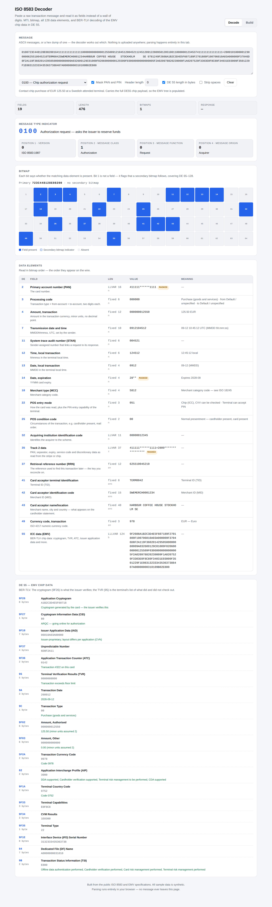

# ISO 8583 Decoder

**[Live demo](#) · Runs entirely in the browser — no message ever leaves the page.**

When a card payment fails, the answer is usually sitting in a raw ISO 8583 message: a few hundred
characters with no field names, no delimiters, and no clue where one value ends and the next
begins. Working out what it says means counting characters against a specification table by hand.

This tool does the counting. Paste the message, get the fields.



---

## What it does

| | |
|---|---|
| **MTI** | Breaks the four digits into version, message class, function and origin, with a plain-language summary. |
| **Bitmap** | Expands the primary and secondary bitmaps into a 128-cell grid so you can see at a glance which fields are present — and which bit is the secondary-bitmap indicator rather than a field. |
| **Data elements** | All 128 elements with their ISO name, content type, length rule, value and meaning. Handles fixed, LLVAR and LLLVAR fields. |
| **EMV chip data** | Parses DE 55 as BER-TLV, including multi-byte tags, long-form lengths and nested constructed tags. Decodes the cryptogram type, TVR bit by bit, AIP, TSI and more. |
| **Code dictionaries** | DE 39 response codes, DE 3 processing codes, DE 22 POS entry modes, DE 25 condition codes, DE 70 network codes, currencies with correct minor units. |
| **Builder** | The inverse: give it fields, it computes the bitmap and packs the message. Useful for producing test vectors. |
| **Masking** | PAN, track data, expiry and PIN blocks are masked by default. Real traces get pasted into tools like this one, so masking is the default rather than an option you have to remember. |

## Why it exists

I work in payment operations. Most of what reaches me during an incident is a message or a trace,
and the fastest way to answer "why did this decline" is to read the thing directly rather than wait
for someone else to interpret it. This is that reading step, made repeatable.

It is also a decent way to learn the format. The bitmap in particular is much easier to understand
as 128 lit and unlit cells than as `723C448128E08200`.

## Try it

```
0100723C448128E082001641111111111111110000000000000125500912104512004521124512091228095812
0510011000000123453741111111111111111=28091010000012300000625510045210TERM0042SWEMERCH0001
234HARBOUR COFFEE HOUSE   STOCKHOLM     SE 9781249F2608A1B2C3D4E5F607189F2701809F100706010A
03A000009F37046D8F2A119F36020142950500000080009A032609129C01009F0206000000012550
9F03060000000000005F2A020978820239009F1A0207529F3303E0F8C89F34031E03009F3501229F1E08313233
34353637388407A00000000310109B02E800
```

A EUR 125.50 chip purchase. Paste it in and the DE 55 tree fills out — cryptogram, ATC, and a TVR
that says the transaction went online because it exceeded the terminal's floor limit.

Six sample messages ship with the tool: chip authorization request, approved and declined
responses, a magstripe-fallback financial request, a reversal with DE 90, and a network echo test.

## Running it

```bash
npm install
npm run dev        # http://localhost:5173
npm test           # 48 tests
npm run build      # static site in dist/
```

`SINGLE_FILE=1 npm run build` produces a single self-contained `index.html` in `dist-single/`,
with everything inlined — convenient for dropping onto an internal wiki page.

## How it works

```
raw input
   │
   ├─ normalize ─ strip line breaks; detect and decode a hex dump of an ASCII message
   │              (spaces are kept — DE 43 is legitimately space-padded)
   ├─ header ──── skip N characters of TPDU or length prefix, if configured
   ├─ MTI ─────── 4 digits → version / class / function / origin
   ├─ bitmap ──── 16 hex chars; if bit 1 is set, read 16 more for DE 65–128
   │
   └─ for each set bit, in order:
          look up the field spec
          read the 2- or 3-digit length prefix if the field is variable
          slice that many characters
          interpret, and for DE 55 recurse into the TLV parser
```

Then a second pass fills in interpretations that depend on other fields — amounts are formatted
using the minor units of the currency in DE 49, for instance.

### Two things worth knowing

**Binary length prefixes count bytes, not characters.** A DE 55 prefix of `124` means 124 bytes,
which is 248 hex characters on the wire. Most implementations follow the standard here, a few
don't, and getting it wrong is the single most common reason a DE 55 parse slides out of
alignment. The tool exposes it as a toggle instead of guessing.

**Bit 1 is not a data element.** It flags the presence of a secondary bitmap. Counting it as DE 1
shifts every subsequent field by one and produces a parse that looks almost right, which is worse
than one that obviously fails.

## Design notes

- **Nothing is uploaded.** Parsing is pure client-side TypeScript with no network calls, so a real
  trace can be pasted in without it leaving the browser tab.
- **Malformed input degrades, it doesn't crash.** A truncated message returns the fields it managed
  to read plus a warning saying where it stopped. During an incident, half a parse beats an error
  page.
- **Samples are generated, not hardcoded.** They're stored as field maps and packed by the builder
  on demand, so a sample can never drift out of sync with the parser. The test suite round-trips
  every one of them.

## Data

Everything here comes from public sources — the ISO 8583:1987 field layout and the EMV 4.3 tag
list. Every sample message is synthetic: standard test PANs, invented merchants, random bytes
where a cryptogram would be. No production traffic, no real merchant, no processor's file format.

## Tests

```
48 passing — bitmap round-trips, sample pack/unpack, EMV TLV edge cases
             (multi-byte tags, long-form lengths, nested constructed tags,
             truncated tails), masking, malformed input handling
```

## Stack

TypeScript · React · Vite · Vitest. No runtime dependencies beyond React.

## License

MIT
